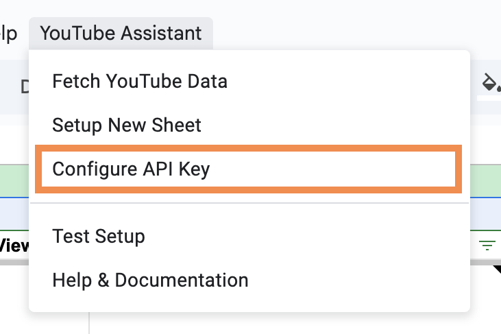
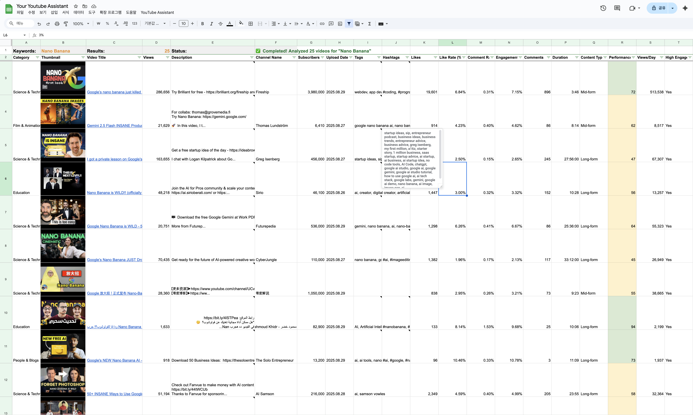
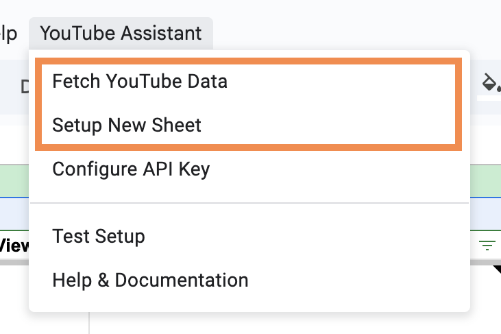

# 💬 YouTube Assistant

> **Transform YouTube research into actionable insights with Google Sheets**

A powerful YouTube analytics tool that turns complex video data into clear, actionable insights. Perfect for content creators, marketers, and researchers who need to understand YouTube trends without expensive analytics platforms.

## 📋 Table of Contents

- [Why YouTube Assistant?](#-why-youtube-assistant)
- [Features](#features)
- [Setup](#setup)
- [What You Get](#what-you-get)
- [How to Use](#️how-to-use)
- [Data Columns](#data-columns)
- [Use Cases & Success Stories](#use-cases--success-stories)
- [Troubleshooting](#troubleshooting)
- [Contributing](#-contributing)

## 🚀 Why YouTube Assistant?

- **💰 Completely Free**: No expensive analytics subscriptions needed - 100% free forever!
- **⚡ Fast Setup**: Ready in 1 minute with Google Sheets
- **📈 Deep Insights**: 20+ metrics including engagement rates, performance scores, and trend analysis
- **🎯 Smart Analysis**: Automatically identifies high-performing content and content gaps
- **📱 Shorts Ready**: Dedicated analytics for YouTube Shorts (≤60 seconds)

## Features

- **Shorts Support**: Dedicated analytics for videos ≤60 seconds
- **Detailed Metrics**: Views, likes, comments, subscriber counts, engagement rates
- **Trend Analysis**: Hashtag extraction and content categorization
- **Real-time Progress**: Live updates while fetching data
- **Performance Score**: 0-100 composite performance rating

## Setup

### 1. Create Google Sheet & Add Code

1. Go to [Google Sheets](https://sheets.google.com) and create a new sheet
2. Open **Extensions** → **Apps Script**
3. Delete any existing code in the editor
4. Copy and paste ALL the code from `youtube-assistant.js`
5. Save the project (Ctrl+S or Cmd+S)
6. **Important**: Refresh your Google Sheet to see the menu appear

### 2. Get YouTube API Key

- Visit [Google Cloud Console](https://console.cloud.google.com/)
- Create a new project or select existing one
- Enable [YouTube Data API v3](https://console.cloud.google.com/apis/api/youtube.googleapis.com) in APIs & Services → Library
- Create credentials → API Key and Copy the API key

### 3. Configure API Key

**Option A: Use the menu (Recommended)**

1. Refresh your Google Sheet to see the YouTube Assistant menu
2. Click **YouTube Assistant** → **Configure API Key** from the menu
3. Enter your API key when prompted
4. Click OK to save

**Option B: Edit the code directly**

1. Find the `setupApiKey()` function in the Apps Script editor
2. Replace `"YOUR_API_KEY_HERE"` with your actual API key
3. Run the `setupApiKey` function once from the Apps Script editor

## What You Get

After running the analysis, you'll see a comprehensive spreadsheet like this:

### Key Insights You'll Discover:

- **🏆 Top Performers**: Videos with highest engagement and performance scores
- **📊 Content Gaps**: Underrepresented categories and formats in your niche
- **⏰ Best Upload Times**: Optimal days and hours for publishing
- **🔥 Commonly Used Hashtags**: Most effective hashtags in your topic area
- **📈 Engagement Patterns**: What drives likes, comments, and views

## How to Use

1. Click **YouTube Assistant** → **Setup New Sheet** to generate a new analysis sheet
2. Enter search term in **`B1`** (e.g., "javascript tutorial")
3. Enter number of results in **`D1`** (recommended: 25-50)
4. Click **YouTube Assistant** → **Fetch YouTube Data**
5. Wait for completion (progress shown in F1)

### 💡 Pro Tips for Better Results:

- **Research Competitors**: Search for your competitors' topics
- **Find Content Gaps**: Look for underrepresented categories
- **Optimize Timing**: Use upload pattern analysis for better reach
- **Track Trends**: Monitor hashtag performance over time

## Data Columns

Click to see all 21 data columns and metrics

### 📈 Basic Metrics

- **Category**: Video category (e.g., Education, Entertainment)
- **Thumbnail**: Clickable video preview image
- **Video Title**: Clickable link to the video
- **Views**: Total view count
- **Description**: Video description (truncated for display)
- **Channel Name**: Creator name
- **Subscribers**: Channel subscriber count
- **Upload Date**: When the video was published

### 🏷️ Content Analysis

- **Tags**: Video tags from creator
- **Hashtags**: Extracted hashtags from title and description
- **Duration**: Video length
- **Content Type**: Shorts/Mid-form/Long-form categorization
- **Captions Available**: Whether video has captions

### 💡 Engagement Metrics

- **Likes**: Total like count
- **Like Rate (%)**: Likes as percentage of views
- **Comment Rate (%)**: Comments as percentage of views
- **Engagement Rate (%)**: Combined engagement metric
- **Comments**: Total comment count

### 🚀 Performance Indicators

- **Performance Score**: 0-100 composite rating
- **Views/Day**: Average daily views since upload
- **High Engagement**: Yes/No indicator for top performers

## Use Cases & Success Stories

### 📺 Content Creators

- **Find Winning Topics**: Discover high-engagement content in your niche
- **Optimize Upload Schedule**: Use data-driven timing for maximum reach
- **Beat the Algorithm**: Identify trending hashtags and formats

### 📈 Digital Marketers

- **Competitor Analysis**: Analyze competitor content strategies
- **Campaign Planning**: Find the best-performing content types
- **ROI Tracking**: Measure content performance across campaigns

### 🔬 Researchers & Analysts

- **Market Research**: Understand content trends in any industry
- **Academic Studies**: Gather YouTube data for research projects
- **Trend Analysis**: Track content evolution over time

## Troubleshooting

**"Execution started" but nothing happens?**

1. Check the **Execution log** in Apps Script for error messages
2. Run **YouTube Assistant** → **Test Setup** to check if everything is configured
3. Make sure you configured your API key using the menu or setupApiKey function

**Menu not showing up?**

1. Refresh your Google Sheet (F5 or Cmd+R)
2. Try running the script again from Apps Script

**"Invalid API key" error?**

- Double-check your API key is copied correctly (no extra spaces)
- Make sure YouTube Data API v3 is enabled in Google Cloud Console
- Try reconfiguring using **YouTube Assistant** → **Configure API Key**
- Run **YouTube Assistant** → **Test Setup** to verify configuration

**Tool running slowly?**

- Use fewer results (10-25 for quick analysis)
- Try more specific search terms
- Check your internet connection

**Getting quota or rate limit errors?**

- Reduce the number of results per search
- Wait a few minutes before trying again

**Still having issues?**

1. Run **YouTube Assistant** → **Test Setup** from the menu
2. Check the execution log in Apps Script for detailed error messages
3. Make sure all the code from `youtube-assistant.js` is copied correctly

## 🤝 Contributing

We welcome contributions! Here's how you can help:

- 🐛 **Report Bugs**: Found an issue? [Open an issue](https://github.com/clairechung/YoutubeAssistant/issues/new)
- 💡 **Suggest Features**: Have ideas? We'd love to hear them!
- 🔧 **Submit PRs**: Code improvements are always welcome
- ⭐ **Star the Repo**: Help others discover this tool!

## 🙏 Support

If this tool helped you, consider:

- ⭐ Starring this repository
- 🐦 Sharing on social media
- � Telling other creators about it

**License**: Apache 2.0 - free to use, modify, and distribute with attribution.

---

**Made with ❤️ for the YouTube creator community**

_Transform your YouTube strategy with data-driven insights - no expensive tools required!_
